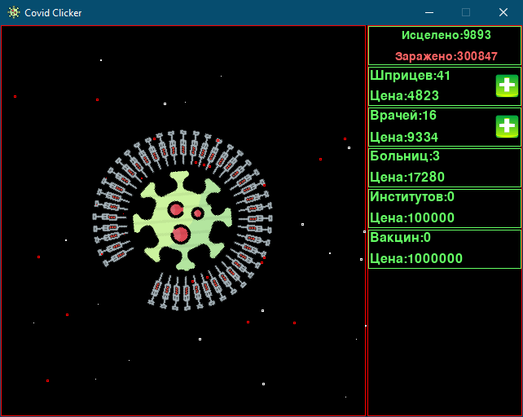

# covidclicker

## Игра-кликер на тему коронавируса

Цель игры - лечение зараженных вирусом людей. Для лечения можно кликать по вирусу, потом по мере накопления вылеченных, можно приобретать шприцы, которые будут лечить по одному человеку в секунду, затем врачей, которые лечат по 10 человек, больницы - по 100, институты - по 1000, вакцины - по 10000. Цены на приобретение повышаются с каждым приобретенным объектом.

Программа является рабочим прототипом игры, в дальнейшем можно добавить бонусы на увеличение количества излеченных и улучшения для объектов.

Для запуска игры нужно запустить файл mainwindow.py

Пример работы игры в файле clicker-video.gif: Красные точки - зараженные, белые - исцеленные.

Примеры скриншотов на разных этапах игры

1. Начало работы. Куплено два шприца. Размер зараженных 1

   

2. Второй этап, можно приобрести врача, размер зараженных 1-2 что соответствует 1 и 10 больным

   

3. Третий этап, можно приобрести больницу, размеры зараженных от 1 до 3

   

4. Приобретено 3 больницы.

   

5. Четвертый этап, можно купить институт

   

6. Пятый этап, можно купить вакцину

   

7. Вакцина куплена

